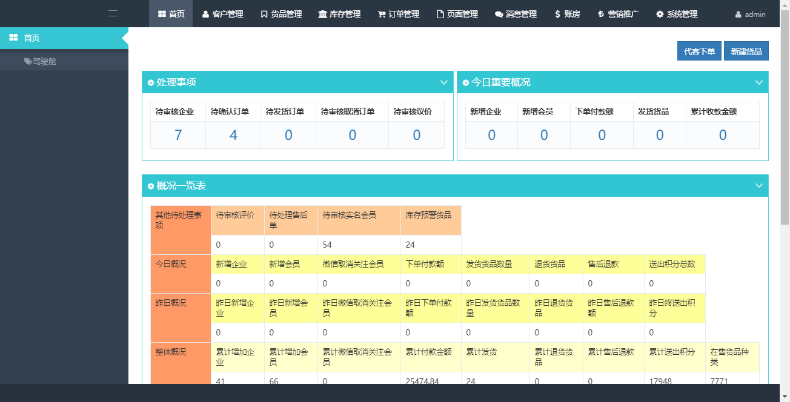
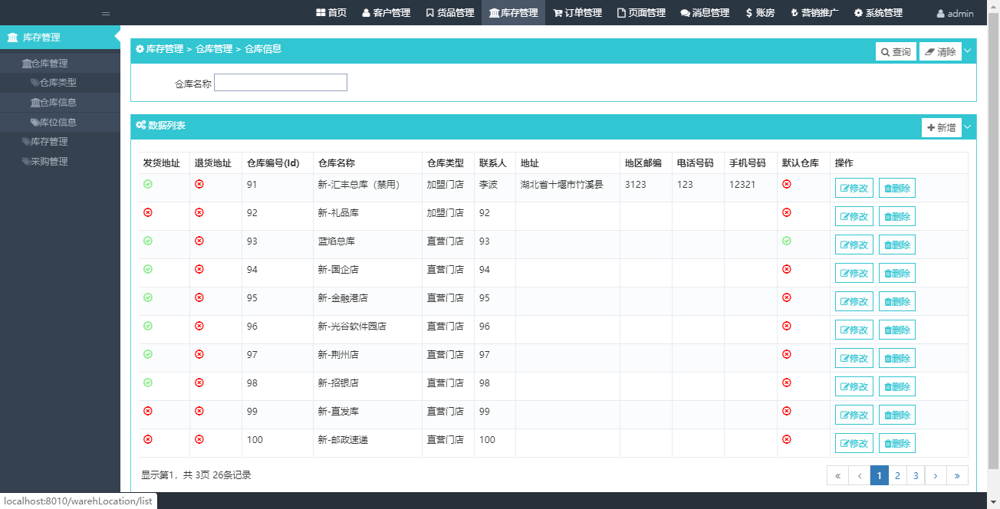

# kkshop

#### 介绍
支持平台自营B2B、B2C、微商城模式。以其丰富的营销功能，精细化的用户运营，解决电商引流、推广难题，帮助企业打造生态级B2B2C盈 利模式商业平台。
提供完备的电商功能：符合行业规则与习惯的前端，操作方便逻辑缜密的后台管理系统，整套系统安全、稳定，便捷的功能 扩展及可以进行二次开发的商城源码，
为企业电商业务长线快速发展提供了强有力的保障

交流群:1005105627 
#### 软件架构
springboot 

#### 安装教程
http://localhost:8010/               admin/admin

1.  xxxx
2.  xxxx
3.  xxxx

#### 相关界面

